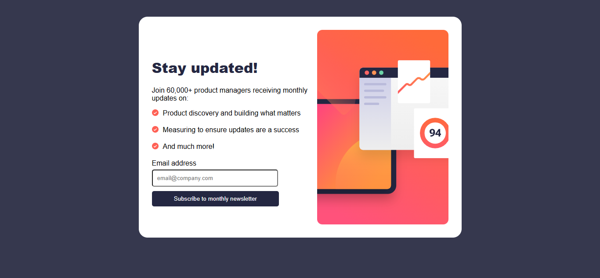

# Frontend Mentor - Newsletter sign-up form with success message solution

This is a solution to the [Newsletter sign-up form with success message challenge on Frontend Mentor](https://www.frontendmentor.io/challenges/newsletter-signup-form-with-success-message-3FC1AZbNrv). Frontend Mentor challenges help you improve your coding skills by building realistic projects.

## Table of contents

- [Overview](#overview)
  - [The challenge](#the-challenge)
  - [Screenshot](#screenshot)
- [My process](#my-process)
  - [Built with](#built-with)
  - [What I learned](#what-i-learned)
  - [Continued development](#continued-development)
  - [Useful resources](#useful-resources)
- [Author](#author)

## Overview

### The challenge

Users should be able to:

- Add their email and submit the form
- See form validation when the email input is empty or invalid
- View the optimal layout for the page depending on their device’s screen size
- See hover and focus states for interactive elements

### Screenshot

## My process

### Built with

- Semantic HTML5
- CSS custom properties
- Flexbox
- Responsive design
- Media queries

### What I learned

While working on this project, I improved my understanding of layout and responsiveness using Flexbox. I also learned how to:

- Center elements properly using `margin: 0 auto`
- Create responsive layouts with media queries
- Style forms and inputs for better user experience
- Structure HTML content more clearly for readability

This project helped me get more comfortable building real-world UI layouts with just HTML and CSS.

### Continued development

Going forward, I want to:

- Improve my form validation using JavaScript
- Add a success message page after form submission
- Practice more responsive layouts for different screen sizes
- Write cleaner and more semantic HTML

### Useful resources

- [MDN Web Docs](https://developer.mozilla.org/) – Helped me understand Flexbox and form elements better
- [Frontend Mentor](https://www.frontendmentor.io/) – Great platform for practicing real-world projects

## Author

- Name – Oluwole Greatness Adeola
- Frontend Mentor – [@grestudio](https://www.frontendmentor.io/profile/greystudio)
- Twitter – [@greythedev](https://twitter.com/greythedev)
